# PipPipGo — page flows and functions

Interactive offline atlas: [page-flows.html](page-flows.html). Based on current iOS source; introduction update is awaiting Dev deployment.

## 00. App overview

The whole experience: authenticate, get to know the traveler, then plan and adapt a trip.

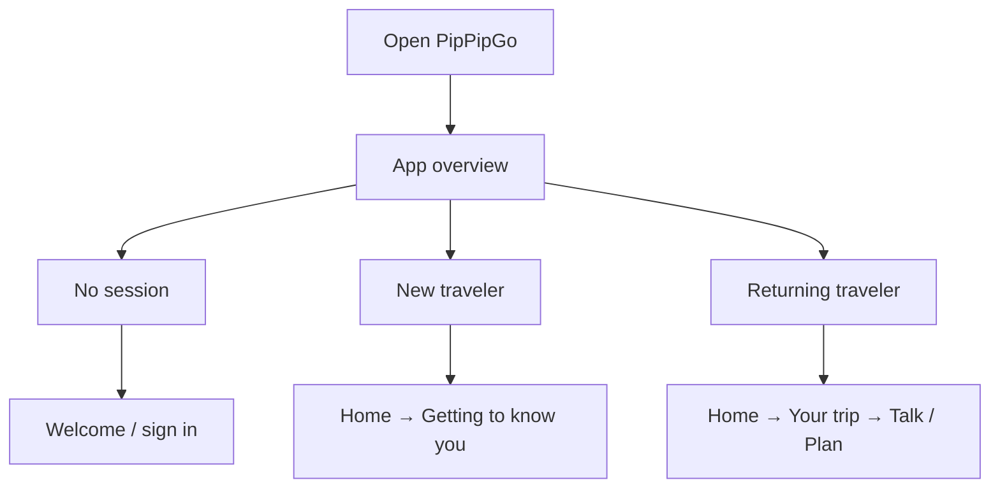

Identity is shared across trips; traveler memory is separate from trip context.

## 01. Welcome / sign in

Start Google sign-in without collecting credentials inside Pip.

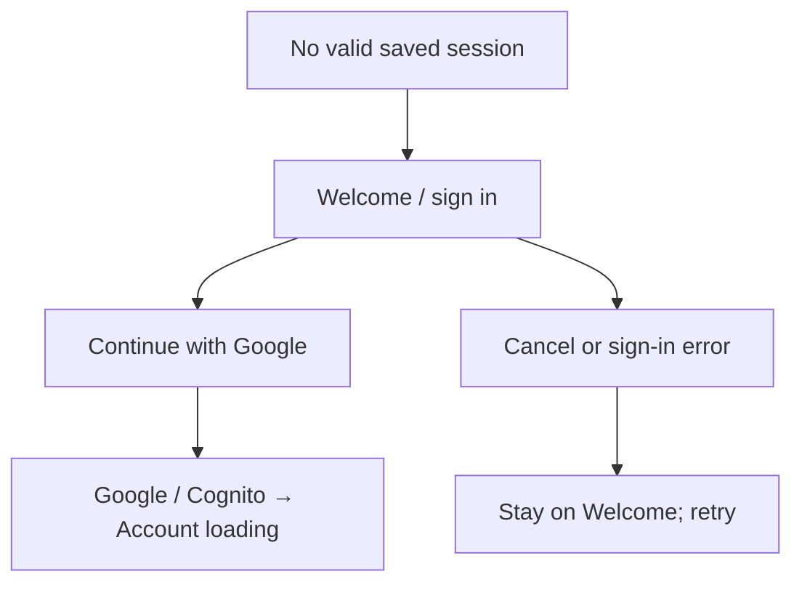

PKCE, secure callback, Keychain session; no trip is created.

## 02. Account loading

Restore or validate the session and load the owned account.

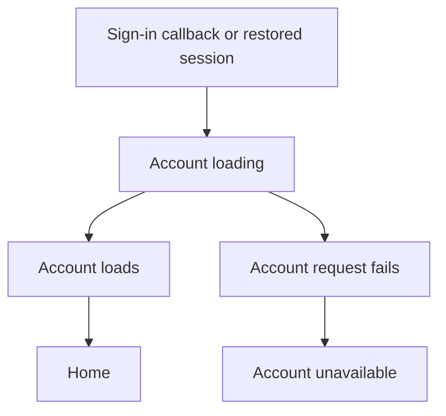

Authenticated GET /v1/me; refresh uses the existing auth client.

## 03. Account unavailable

Explain account loading failure without silently discarding the session.

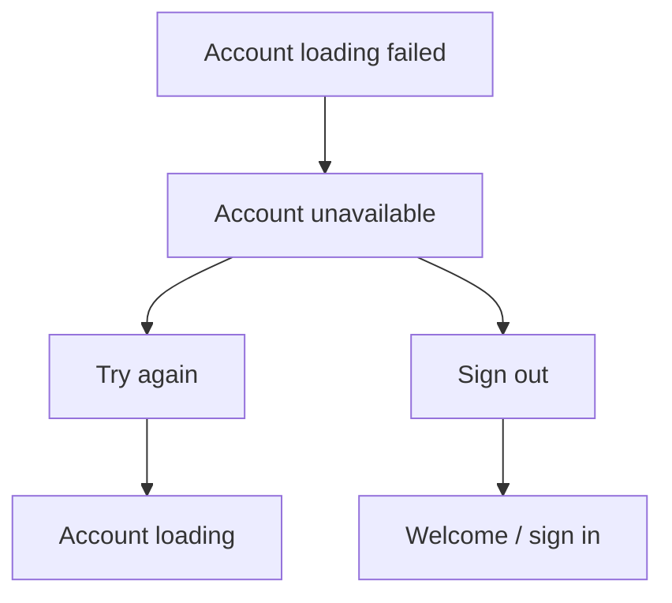

Only the account request is retried; sign-out clears local session state.

## 04. Home

Greet by confirmed preferred name and show the appropriate starting point plus saved trips.

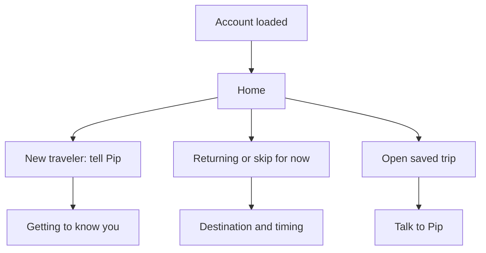

Loads journeys, traveler memory, saved travelers and introduction completion. Menu opens memory, language or sign-out.

## 05. Getting to know you

Optional story-led conversation about the person before creating a trip.

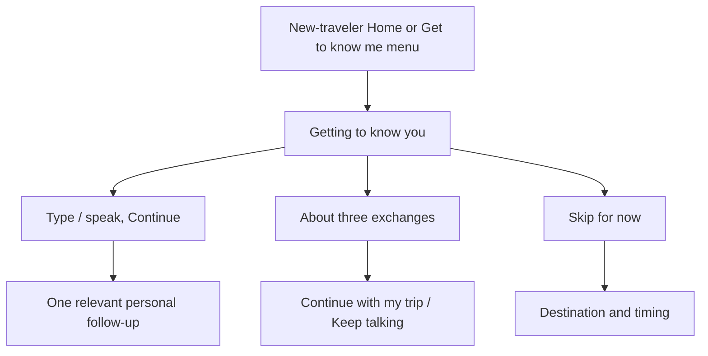

GET/PUT /v1/traveler-conversation. Saves owned messages/completion; no phantom trip. Inferred memories require review.

## 06. Destination and timing

Collect or edit the minimum trip context without repeating known information.

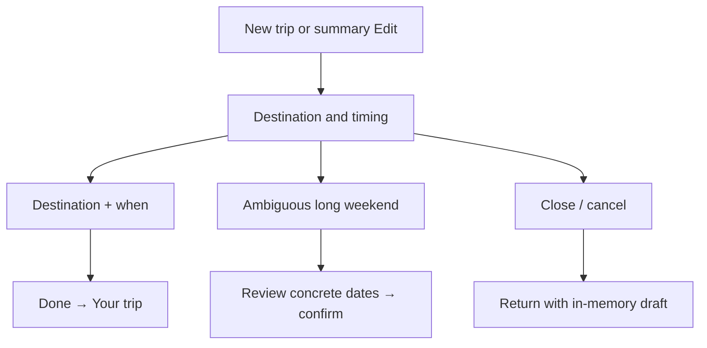

Edits the client draft. API save occurs on the next deliberate trip action. Exact or approximate timing is supported.

## 07. Your trip

One compact summary, one active question, one answer area and a visible next action.

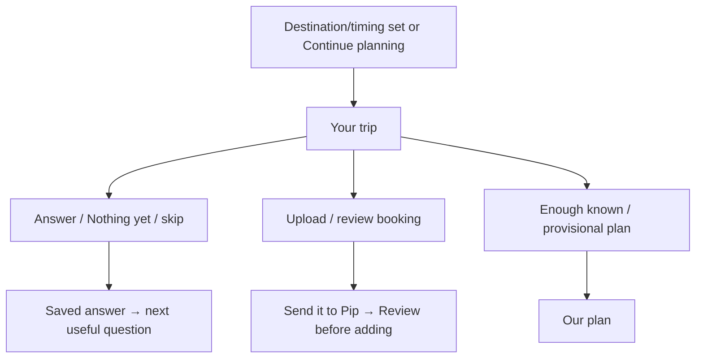

Versioned PUT journey and intake/skip actions. Reopens saved progress; no visible planning-state questionnaire.

## 08. Talk to Pip

One trip conversation that uses known facts and accepts corrections or feedback.

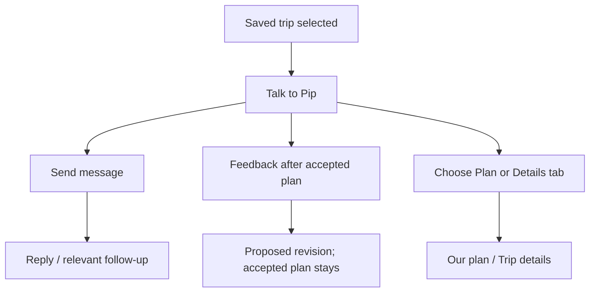

Owned conversation and scoped memory; temporary feedback remains separate. Attachments go through review.

## 09. Our plan

Show fixed bookings, transfer windows and optional suggestions separately.

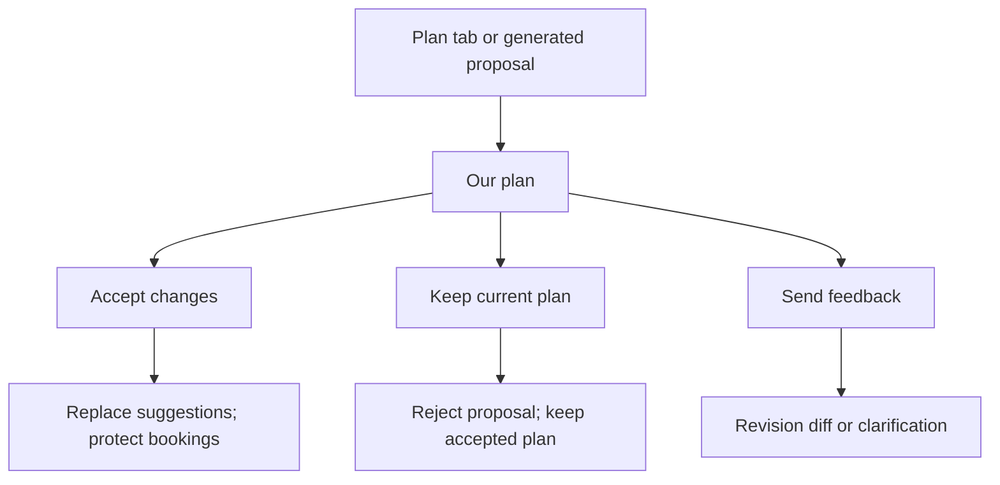

Explicit accept/reject actions. Changes list stays/adds/changes/removes. Empty clarification never clears the plan.

## 10. Trip details

Review known trip facts and enter focused editors only when needed.

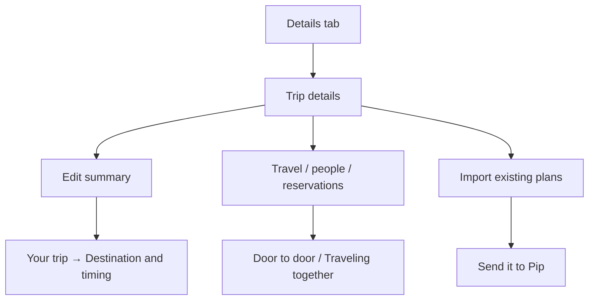

Displays current context, timing and import status. It is separate from the light first screen.

## 11. Send it to Pip

Attach travel material or paste booking text for extraction.

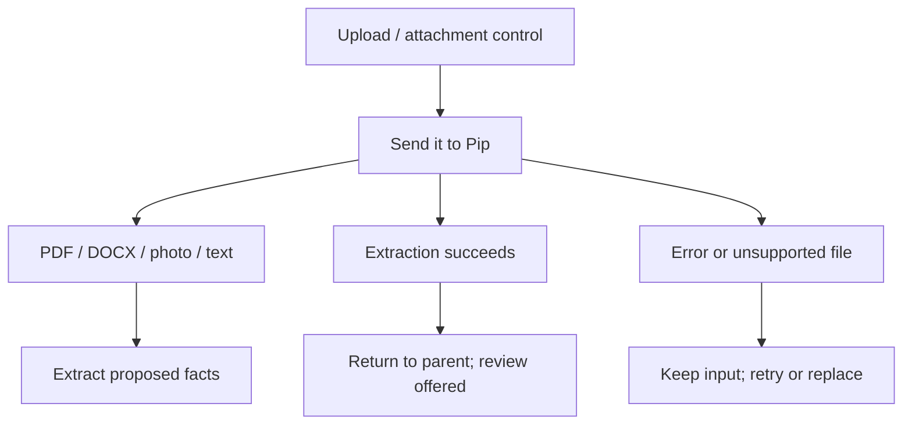

PUT journey imports. Raw file bytes are processed server-side; extracted facts are not yet authoritative. Camera/live voice are not implemented here.

## 12. Review before adding

Let the traveler correct or reject extracted facts before planning uses them.

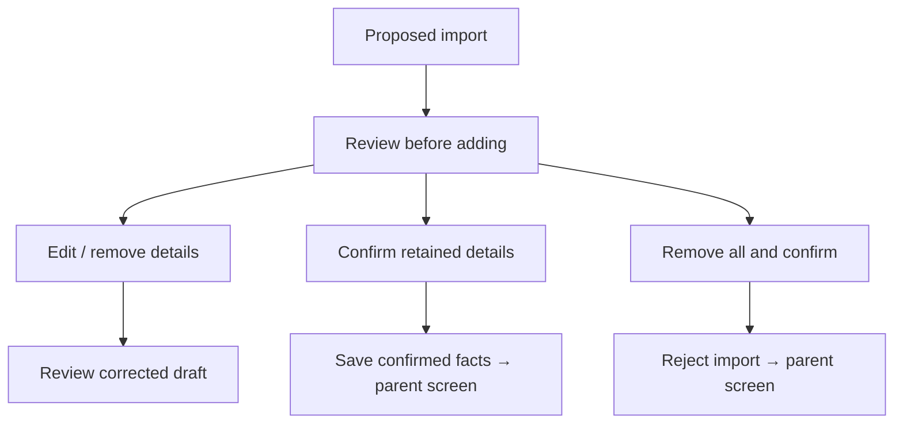

review_import is versioned and retry-safe. Only reviewed flights enter authoritative door-to-door context.

## 13. Door to door

Progressively capture how the traveler reaches the destination, flights and arranged transfers.

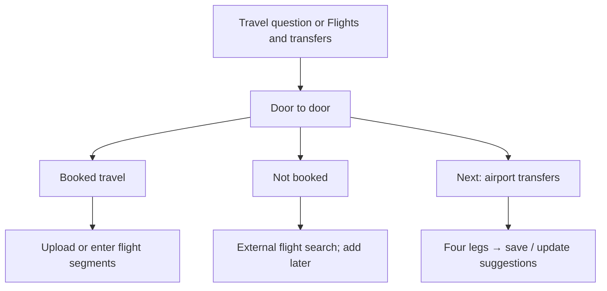

Actual airports and local times drive provisional windows. No live status, price, pickup verification or automatic booking.

## 14. Traveling together

Choose this trip’s travelers and optional needs without inferring sensitive traits.

Saved traveler identity is distinct from trip-specific people/needs. Existing validation and ownership apply.

## 15. Make room for what matters

Capture lodging, fixed commitments and constraints that should shape the plan.

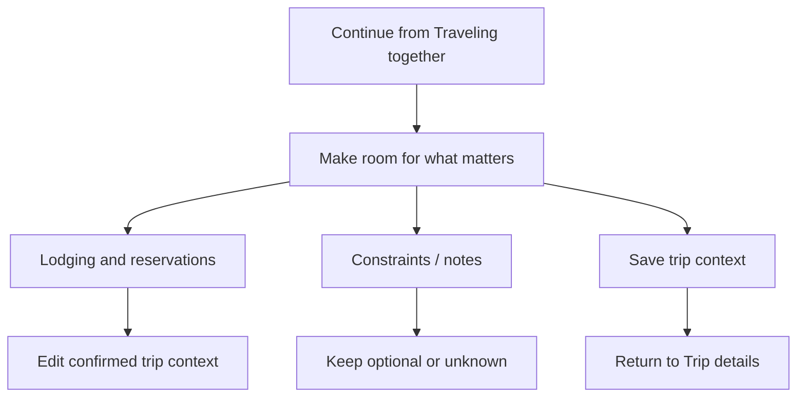

Replacement writes preserve supported trip fields; uncertain writes keep their original identity for retry.

## 16. What Pip remembers

View, correct or forget reusable knowledge, and edit the preferred name.

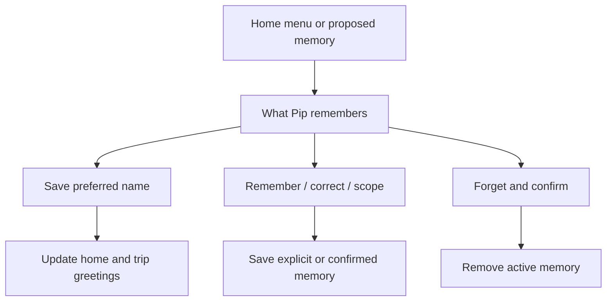

Memory uses authenticated ownership, versioning and source/scope metadata. Trip-specific context does not erase general preferences.

## 17. Language

Choose the application language while retaining trips and memories.

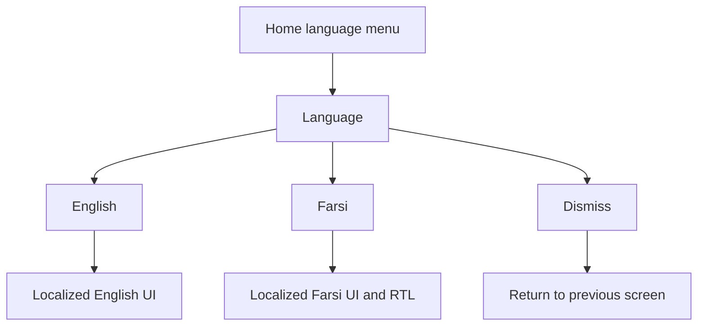

App language is stored locally; each trip also has its own conversation language. Live language-switch acceptance remains pending.

## 18. Retry and conflict recovery

Recover from failures without losing drafts, duplicating writes or silently overwriting newer data.

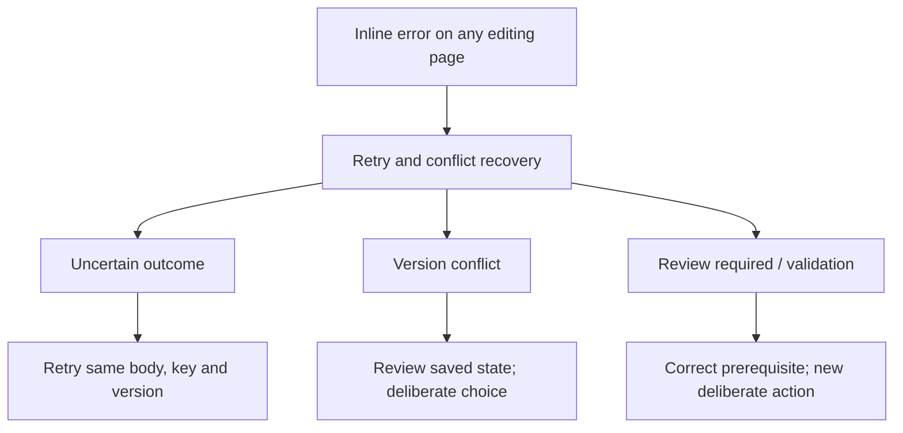

Shared recovery component, not a separate navigation page. Account changes clear owned drafts and ignore late responses.
